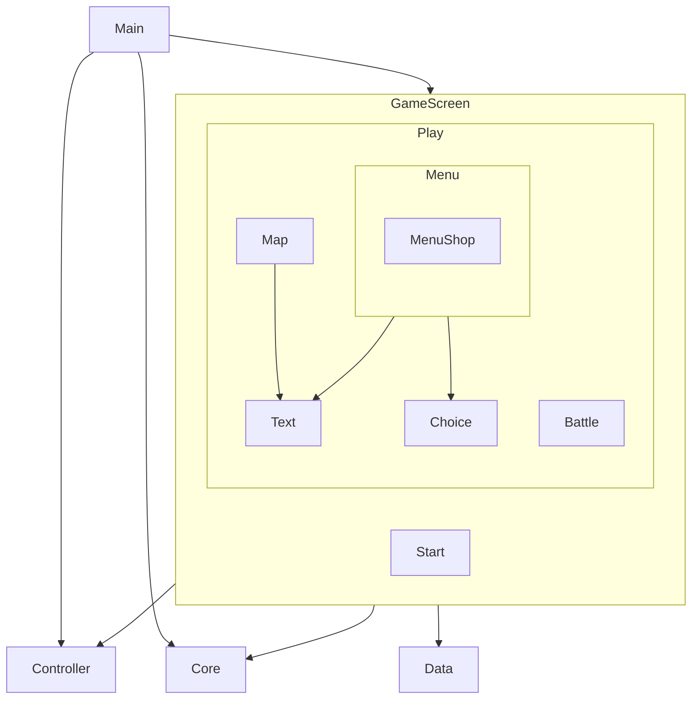
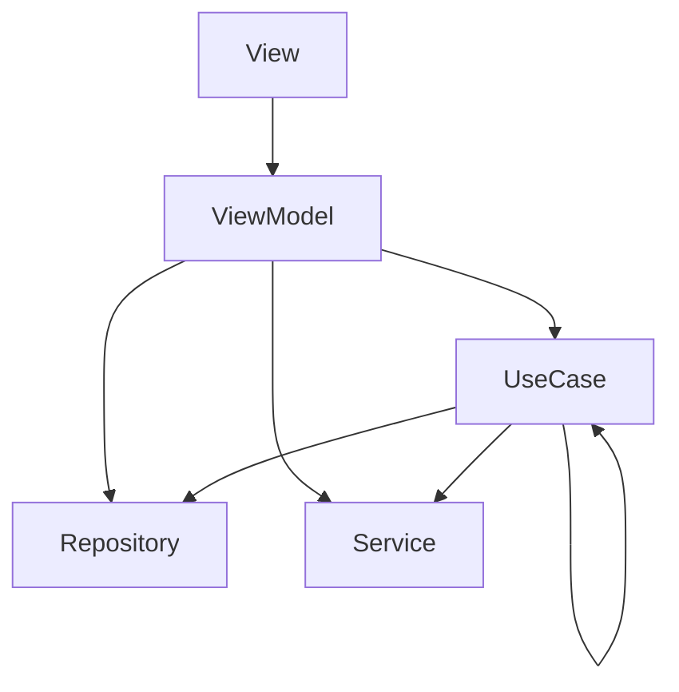

[ここ](https://kmp.jetbrains.com/)のwizardを利用して作成した基本を利用

[前まで作っていたRPG](https://github.com/sbkinoko/RPG_Engine)を作り直す

# ざっくり構成イメージ
## package単位

```mermaid
graph TD;
  Main --> GameScreen;
  Main --> Controller;
  subgraph GameScreen;
    Start;
    Play;
      subgraph Play;
        Map;
        Menu;
          subgraph Menu;
            MenuShop;
          end;
        Battle;
        Text;
        Choice;
        MenuShop;
        Menu --> Text;
        Menu --> Choice;
        Map --> Text;
    end;
  end;
  GameScreen --> Core;
  GameScreen --> Controller;
  GameScreen --> Data;
  Main --> Core;
```

## 各画面のレイヤ構成

```mermaid
graph TD;
  View-->ViewModel;
  ViewModel --> UseCase;
  ViewModel --> Repository;
  ViewModel --> Service;
  UseCase --> UseCase;
  UseCase --> Service;
  UseCase --> Repository;
```
